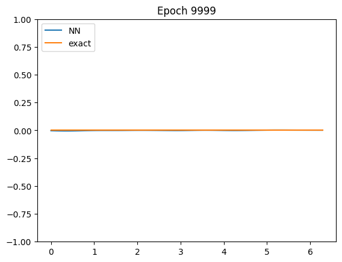
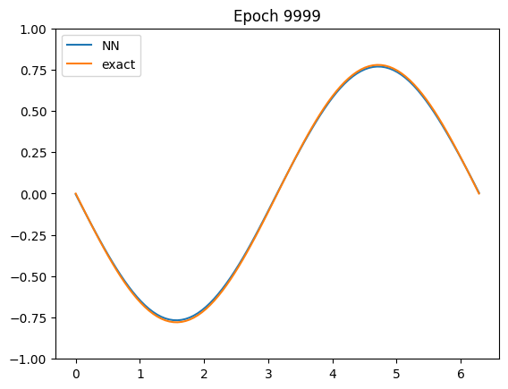

# Deep branching solver for PDE system
Deep branching solver based on [[NPP22]](#nguwi2022deepbranching)
aims to solve system of fully nonlinear PDE of the form\
\
with\
\
and\


We let


\
so that the PDE system becomes the 2D incompresible Navier-Stokes equation.

In this case, we additionally have the divergence free constraint given by\


We further assume the Taylor-Green terminal condition

and

so that the PDE system admits the true solution of\

and


For illustration purposes,
suppose that we are only interested in the solution u(T/2, x) for


## Using deep branching solver
There are two ways to utilize the deep branching solver:
1. Edit the templates inside the `__main__` environment
   in `branch.py`, then run `python branch.py` from your terminal.
2. Write your own code and import the solver to your code via `from branch import Net`,
   see the sections [defining the derivatives map and the functions](#defining-the-derivatives-map-and-the-functions)
   and [training the model](#training-the-model).

## Defining the derivatives map and the functions
Functions f and g must be written in the PyTorch framework, e.g.
```python
import math
import torch
import numpy as np

device = torch.device("cuda" if torch.cuda.is_available() else "cpu")
T, x_lo, x_hi, nu = 0.25, 0, 2 * math.pi, 1.0
dim = 2
# deriv_map is n x d array defining lambda_1, ..., lambda_n
deriv_map = np.array(
    [
        [1, 0],  # for nabla p
        [0, 1],
        [0, 0],  # for u
        [0, 0],
        [1, 0],  # for nabla u1
        [0, 1],
        [1, 0],  # for nabla u2
        [0, 1],
    ]
)
zeta_map = np.array([-1, -1, 0, 1, 0, 0, 1, 1])
deriv_condition_deriv_map = np.array(
    [
        [1, 0],
        [0, 1],
    ]
)
deriv_condition_zeta_map = np.array([0, 1])


def f_fun(y, i):
    f = -y[i]
    for j in range(dim):
        f += -y[dim + j] * y[2 * dim + dim * i + j]
    return f

def g_fun(x, i):
    if i == 0:
        return -torch.cos(x[0]) * torch.sin(x[1])
    else:
        return torch.sin(x[0]) * torch.cos(x[1])
```

## Training the model
Next, we are ready to initialize the model and to train it.
After the training,
the graph comparing deep branching solution and the true solution
is plotted.
```python
from branch import Net

# the exact functions are only used for plotting
def exact_u_fun(x, i):
     if i == 0:
         return -torch.cos(x[:, 1]) * torch.sin(x[:, 2]) * torch.exp(-2 * nu * (T - x[:, 0]))
     else:
         return torch.sin(x[:, 1]) * torch.cos(x[:, 2]) * torch.exp(-2 * nu * (T - x[:, 0]))

def exact_p_fun(x):
     return (
         -1
         / 4
         * torch.exp(-4 * nu * (T - x[:, 0]))
         * (torch.cos(2 * x[:, 1]) + torch.cos(2 * x[:, 2]))
     )

# initialize model and training
model = Net(
    deriv_map=deriv_map,
    zeta_map=zeta_map,
    deriv_condition_deriv_map=deriv_condition_deriv_map,
    deriv_condition_zeta_map=deriv_condition_zeta_map,
    f_fun=f_fun,
    phi_fun=g_fun,
    exact_p_fun=exact_p_fun,
    exact_u_fun=exact_u_fun,
    T=T,
    t_lo=0.0,
    t_hi=T,
    x_lo=x_lo,
    x_hi=x_hi,
    device=device,
    nu=nu,
    plot_y_lim=[[-1, 1], [-1, 1]],
)
model.train_and_eval()
```
The resulting plot is available at /path/to/logs/plot/:\



## Loading trained model
Suppose we would like to load a trained model,
either to reuse it or to study the neural function.
We can do so using the `Net.load_dict()` function, i.e.
```python
model = Net(...)
model.load_dict(/path/to/model/)
```

## References
<a id="nguwi2022deepbranching">[NPP22]</a>
J.Y. Nguwi, G. Penent, and N. Privault.
Numerical solution of the incompressible Navier-Stokes equation by deep branching.
